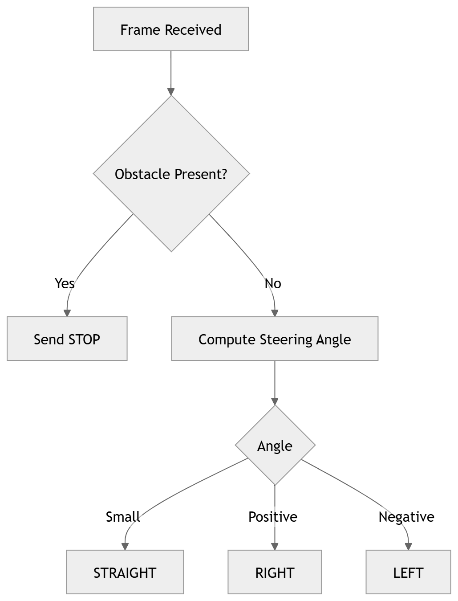

Here is the demo of the videos.
https://snehitt03.github.io/Autonomous-Lane-Follwer-Using-Classical-Computer-Vision-techniques/

<section id="block-diagram">
  <h2>Block Diagram</h2>
  

    The overall architecture of the lane and obstacle detection system consists of 
    multiple processing stages, starting from video acquisition to the final control 
    decision. A detailed explanation of each block in the workflow is provided below.
  

  

    
    
<em>Figure 1: Lane and obstacle detection Workflow</em>

  

  
  

  

  <h3>1. Input Video Feed (Camera / Dataset)</h3>
  

    The system receives a continuous stream of video frames from either a real-time 
    camera (e.g., USB camera, IP camera) or a pre-recorded dataset. This raw video 
    serves as the primary input for all further processing steps.
  

  <h3>2. Pre-processing (Resize, HSV, Mask)</h3>
  
Before applying detection algorithms, each frame undergoes basic pre-processing:

  <ul>
    <li><strong>Resize:</strong> Adjusts the frame size to reduce computational load.</li>
    <li><strong>HSV Conversion:</strong> Converts the RGB frame into HSV color space, which improves the reliability of lane color segmentation.</li>
    <li><strong>Masking:</strong> Applies defined color thresholds to isolate lane regions and remove irrelevant background pixels.</li>
  </ul>
  
This step enhances the image quality and prepares it for lane and obstacle detection.

  <h3>3. Lane Detection (Warp + Analysis)</h3>
  

    This module identifies the left and right lane boundaries. A <strong>perspective transformation</strong> (bird's-eye view) is applied to straighten lane lines and simplify geometry. Lane pixels are then extracted using techniques such as:
  

  <ul>
    <li>Edge detection</li>
    <li>Sliding windows</li>
    <li>Histogram analysis</li>
  </ul>
  
The system estimates lane curvature and driving direction (left, right, or straight).

  <h3>4. Obstacle Detection (Deep Learning)</h3>
  

    The obstacle detection module identifies objects such as vehicles, pedestrians, road barriers, and cones using a pre-trained <strong>MobileNet-SSD</strong> model (Caffe framework).
  

  <blockquote>
    The detector runs on a cropped region of the frame for real-time performance and triggers safety actions (STOP command) when an obstacle is detected ahead of the vehicle. Optional temporal smoothing can be applied to reduce false positives.
  </blockquote>

  <h3>5. Lane Path and Obstacle Visualization</h3>
  

    This stage overlays the detected left/right lanes, predicted driving path, and bounding boxes of detected obstacles onto the original frame. The combined visualization helps interpret the system's perception of the road environment.
  

  <h3>6. Control / Decision System</h3>
  

    Based on lane curvature and obstacle positions, the decision module generates appropriate steering commands. Possible actions include:
  

  <ul>
    <li>Turning left</li>
    <li>Turning right</li>
    <li>Moving straight</li>
    <li>Stopping (Emergency Brake)</li>
  </ul>
  
These commands are transmitted to the microcontroller (<strong>ESP32</strong>) for physical vehicle control.

  

    
    
<em>Figure 3: Control flow</em>

  

</section>
